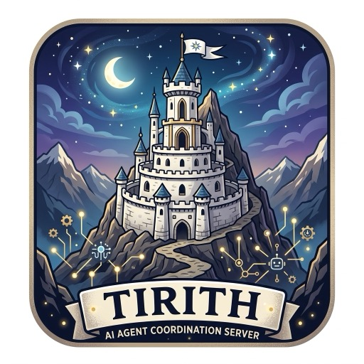

<p align="center">
  
</p>

# Tirith

**A coordination server for parallel coding agents.**

Tirith is a small MCP server that keeps five or ten coding agents from
stepping on each other when they work in the same repository at the same
time. Agents claim files before editing, pull tasks from a shared board,
publish the shape of an interface before either side implements it, announce
renames so dependents can react, and record decisions so nothing gets decided
twice.

It is not a memory layer. It stores coordination state, not knowledge.

Tirith is framework-agnostic: anything that speaks MCP over HTTP can use it.
That includes Claude Code, Cursor, Codex, LangGraph, CrewAI, and a plain
script with `curl`.

> Status: pre-alpha. The claims tool and the two-agent demo are the first
> milestone. See [docs/1-about/01-purpose.md](docs/1-about/01-purpose.md)
> for the roadmap.

## The problem

Run several coding agents on one codebase and three things go wrong:

1. Two agents edit the same file and one silently overwrites the other.
2. One agent renames a function that another agent's in-progress work
   depends on.
3. Two agents build the two sides of an interface to different shapes,
   because nobody wrote the shape down first.

Claims and a task board fix the first problem. Contracts and change notices
fix the second and third, and those are the heart of Tirith, because there is
no good workaround for them today.

## Primitives

| Tool family | What it does |
|---|---|
| **Claims** | An agent claims files or directories before editing. Claims are leases: they expire if the agent dies. Overlapping claims are refused with the owner's name, paths, reason, and expiry. |
| **Task board** | Tasks with status, owner, and dependencies. Agents pull the next unblocked task instead of being assigned one. |
| **Contracts** | Interface shapes (function signatures, request and response types, schemas) published and agreed before implementation begins. |
| **Change notices** | "Renamed `X` to `Y`, callers in these files are affected." Dependents read notices for their area before acting. |
| **Decisions log** | Settled choices with rationale, so no agent re-decides them. |

The full tool list and schemas are in
[docs/1-about/04-primitives.md](docs/1-about/04-primitives.md).

## How it runs

One `tirith` daemon runs per repository and every agent connects to it over
streamable HTTP on localhost. That is the whole trick: MCP clients normally
spawn a fresh server per session, which would give ten agents ten separate
states and nothing to coordinate. Tirith is deliberately a single shared
process.

State is tiny and lives in memory, written through to JSON under `.tirith/`
in the target repository. Contracts, notices, and decisions are meant to be
committed so the next session inherits them. Claims and the task board are
runtime state and are gitignored.

## Quick start

```bash
cargo install --path .
cd /path/to/your/repo
tirith serve            # starts the daemon on http://127.0.0.1:7477/mcp
```

Point your agents at it. For Claude Code:

```bash
claude mcp add --transport http tirith http://127.0.0.1:7477/mcp
```

For Cursor, add to `.cursor/mcp.json`:

```json
{ "mcpServers": { "tirith": { "url": "http://127.0.0.1:7477/mcp" } } }
```

Other clients, including LangGraph, CrewAI, and raw JSON-RPC, are covered in
[docs/2-examples/02-client-setup.md](docs/2-examples/02-client-setup.md).

## Example: two agents, one file

Agent A claims the auth module. Agent B tries to claim a file inside it and
is refused with enough information to decide what to do next.

```bash
tirith serve &
tirith claim --agent alice --reason "refactor session handling" src/auth/
# ok: alice holds src/auth/ until 2026-09-15T18:20:00Z

tirith claim --agent bob --reason "fix login redirect" src/auth/login.rs
# conflict: src/auth/login.rs overlaps src/auth/ held by alice
#   reason:  refactor session handling
#   expires: 2026-09-15T18:20:00Z
```

The same calls from an agent look like this (MCP `tools/call`):

```json
{ "name": "claim",
  "arguments": { "agent": "bob",
                 "paths": ["src/auth/login.rs"],
                 "reason": "fix login redirect" } }
```

```json
{ "status": "conflict",
  "conflicts": [ { "path": "src/auth/login.rs",
                   "overlaps": "src/auth/",
                   "owner": "alice",
                   "reason": "refactor session handling",
                   "expires_at": "2026-09-15T18:20:00Z" } ] }
```

## Example: a contract before the code

Agent A is building an HTTP handler, agent B the client that calls it. A
publishes the shape first; B reads it before writing a line.

```json
{ "name": "contract_publish",
  "arguments": {
    "agent": "alice",
    "name": "POST /api/sessions",
    "kind": "http",
    "shape": {
      "request":  { "email": "string", "password": "string" },
      "response": { "session_id": "string", "expires_at": "rfc3339" },
      "errors":   { "401": "invalid credentials" }
    },
    "consumers": ["src/client/sessions.rs"] } }
```

When A later renames `session_id` to `token`, A publishes a change notice and
B sees it on the next `notice_list` call for `src/client/`.

## Documentation

Everything lives in [docs/](docs/README.md):

- `1-about/` purpose, architecture, project structure, primitives
- `2-examples/` demos and client setup for every supported framework
- `3-tests/` testing strategy and how to run the suite
- `4-style/` Rust rules, sources, git conventions
- `5-decisions/` architecture decision records
- `6-agent-workflow/` how agents work on this repo (Serena, memory, Tirith itself)

Contributing agents must read [AGENTS.md](AGENTS.md).

## License

MIT. See [LICENSE](LICENSE).
